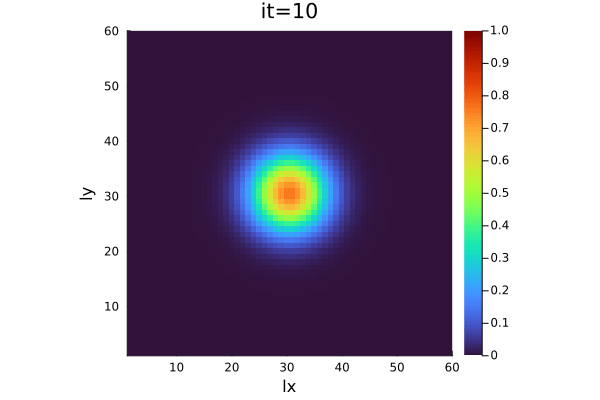

# WSL Julia 2023
WSL workshop - Why I like Julia

## Solving PDEs using Julia for xPU HPC

I mostly use Julia for solving partial differential equtations in parallel on CPUs and GPUs (xPU) using a high-performance computing (HPC) apporach.

### Demo
3D diffusion running in parallel (MPI) on multiple Nvidia (CUDA) or AMD (ROCm) GPUs, on Intel and ARM CPUs and Metal (macOS) GPUs.

    

### Resources
- PDEs on GPUs: https://pde-on-gpu.vaw.ethz.ch
- GPU4GEO: https://ptsolvers.github.io/GPU4GEO/
- JuliaGPU: https://juliagpu.org
- Packages: [ParallelStencil.jl](https://github.com/omlins/ParallelStencil.jl), [ImplicitGlobalGrid.jl](https://github.com/eth-cscs/ImplicitGlobalGrid.jl), [MPI.jl](https://github.com/JuliaParallel/MPI.jl), [Enzyme.jl](https://github.com/EnzymeAD/Enzyme.jl), [TinyKernels.jl](https://github.com/utkinis/TinyKernels.jl)